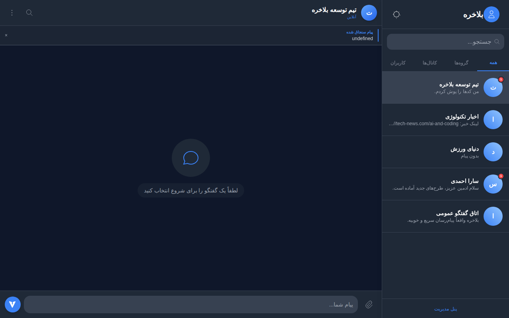
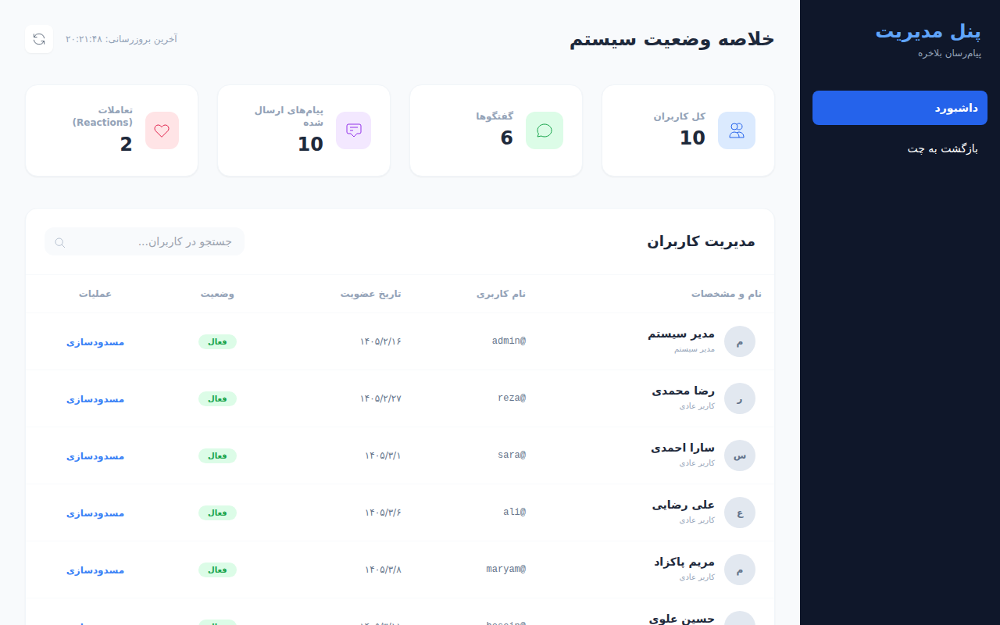
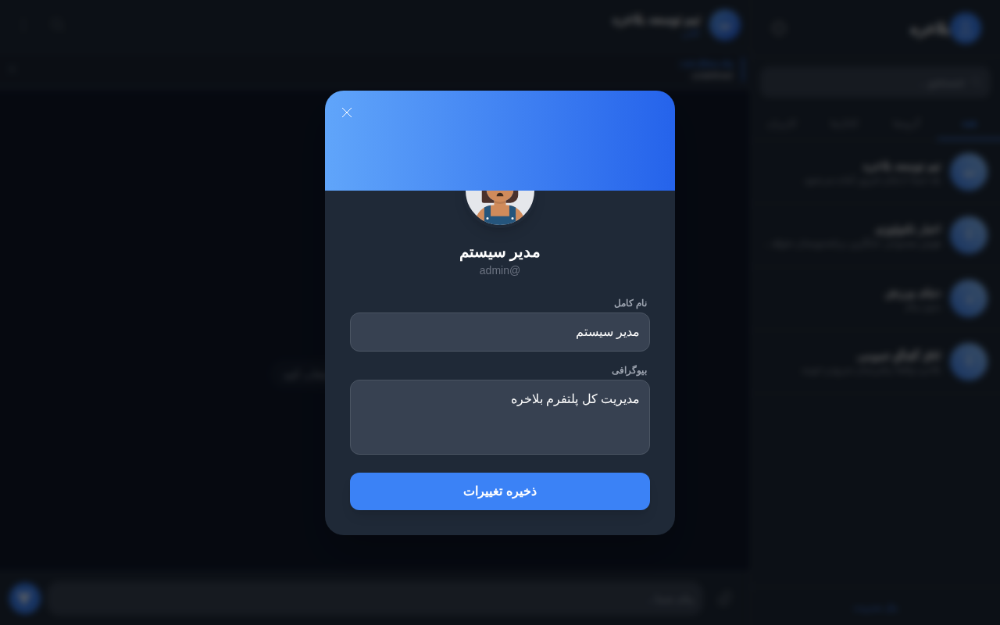
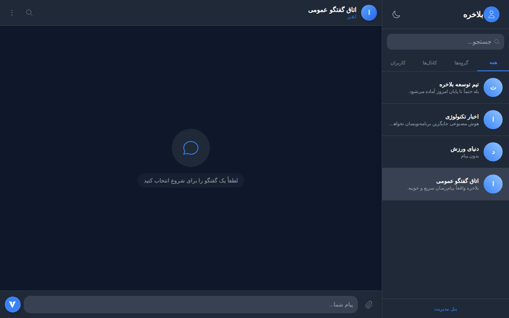

# پروژه پیام‌رسان بلاخره

بلاخره یک پلتفرم پیام‌رسان جامع، آنی و پیشرفته است که با الهام از تلگرام و بله، با استفاده از تکنولوژی‌های مدرن مایکروسافت طراحی و پیاده‌سازی شده است. این پروژه نمایشی از توانمندی در پیاده‌سازی سیستم‌های توزیع شده و آنی (Real-time) با استفاده از SignalR و معماری چندلایه است.

## قابلیت‌های کلیدی و پیشرفته

- پیام‌رسانی آنی: تبادل پیام‌ها در کسری از ثانیه با SignalR.
- انواع گفتگو: پشتیبانی کامل از گفتگوی شخصی (PV)، گروه‌ها، کانال‌های اطلاع‌رسانی و اتاق گفتگو عمومی.
- ابزارهای تعاملی پیشرفته: قابلیت پاسخ (Reply)، فوروارد پیام، و حذف پیام (Unsend).
- مدیریت محتوا: سنجاق کردن (Pin) پیام‌های مهم در هر گفتگو.
- واکنش‌ها (Reactions): امکان ثبت لایک و واکنش‌های مختلف روی پیام‌ها.
- پیش‌نمایش هوشمند لینک: استخراج خودکار متادیتا و نمایش کارت پیش‌نمایش برای لینک‌های وب.
- جستجوی سراسری و داخلی: قابلیت جستجو در لیست گفتگوها و همچنین جستجوی متنی در تاریخچه هر چت.
- مدیریت پروفایل: ویرایش نام، بیوگرافی و تصویر پروفایل توسط کاربر.
- پنل مدیریت قدرتمند: داشبورد اختصاصی برای نظارت بر آمار سیستم و مدیریت کاربران (مسدودسازی).
- پشتیبانی از تم‌های مختلف: حالت تاریک و روشن مدرن با ذخیره‌سازی وضعیت در مرورگر.

## تصاویر محیط برنامه (Seeded Environment)

در زیر تصاویری از محیط کامل شده برنامه با داده‌های فرضی مشاهده می‌کنید:

### محیط چت (حالت تاریک)


### پنل مدیریت سیستم


### تنظیمات پروفایل کاربر


### اتاق گفتگو عمومی (حالت روشن)


---
## ساختار پروژه (Clean Architecture)

- Balakhare.Core: موجودیت‌های اصلی (Entities)، Enumها و منطق پایه.
- Balakhare.Infrastructure: مدیریت داده با EF Core، دیتاسیدر (DataSeeder)، و سرویس‌های پیش‌نمایش لینک و فایل.
- Balakhare.Web: هاب‌های SignalR، کنترلرهای API، پنل مدیریت و رابط کاربری.

## راهنمای نصب و اجرا

۱. اطمینان حاصل کنید که .NET 8 SDK روی سیستم شما نصب است.
۲. وارد پوشه src شوید.
۳. در فایل appsettings.json می‌توانید نوع دیتابیس را تعیین کنید (SQLite پیش‌فرض است).
۴. دستورات زیر را اجرا کنید:
```bash
dotnet build
dotnet run --project Balakhare.Web
```
۵. برنامه در آدرس http://localhost:5000 در دسترس خواهد بود.
۶. برای اولین ورود می‌توانید از نام کاربری admin استفاده کنید تا به پنل مدیریت نیز دسترسی داشته باشید.
